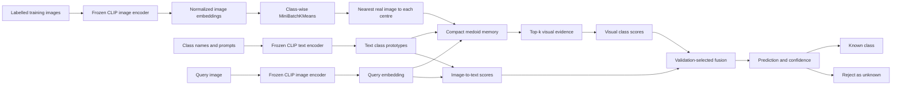

# EvidenceMem

**A compact visual memory that classifies with a frozen CLIP encoder, retrieves the
real images used as decision evidence, accepts new classes without updating the
encoder, and provides signals for rejecting unfamiliar inputs.**

EvidenceMem started with a simple idea: replace a fixed classifier head with a vector
database. A plain vector database plus nearest-neighbour voting was too limited, so the
idea grew into a bounded memory of representative images, reliability-aware retrieval,
CLIP text fusion, online class insertion and unknown-input detection.

This repository contains the reusable Python implementation, a clean Google Colab
experiment notebook and the completed three-seed T4 run with its outputs.

## Start here

| Resource | What it contains |
|---|---|
| [Completed full run](results/evidencemem.ipynb) | Executed 30-cell notebook with the three-seed CIFAR-10/100, OOD, continual, ablation and evidence results shown below |
| [Clean Colab notebook](notebooks/EvidenceMem_Colab_T4.ipynb) | Self-contained source notebook for a new validation or full run |
| [Python package](src/evidencemem) | Reusable memory, indexing, classification, confidence, update and cache code |
| [Research plan](docs/RESEARCH_PLAN.md) | Hypotheses, fair-comparison rules and the claims-to-experiments map |
| [Literature map](docs/LITERATURE_MAP.md) | Prior work and the boundary between known methods and this project |

- [Open the clean notebook in Google Colab](https://colab.research.google.com/github/Prathmesh333/evidencemem/blob/main/notebooks/EvidenceMem_Colab_T4.ipynb)
- [Open the completed run in Google Colab](https://colab.research.google.com/github/Prathmesh333/evidencemem/blob/main/results/evidencemem.ipynb)

The repository is private at the time of writing, so Colab may ask you to authorize
GitHub. Downloading either notebook and uploading it to Colab works as well.

## The idea, and how it changed

The first version was called **Adaptive Vector Memory Network**. Its goal was to encode
an image, search a vector database and use the nearest stored label as the prediction.
That approach had the right practical instinct—new examples can be inserted without
training a new neural network—but it left several problems unsolved:

- Full kNN stores every training embedding.
- A single centroid loses the different visual modes inside a class.
- Synthetic centroids cannot be displayed as supporting images.
- Similarity alone gives weak confidence on unfamiliar inputs.
- A nearest-neighbour label does not use the text knowledge already present in a
  vision-language model.

EvidenceMem is the result of working through those gaps. It keeps a small set of real
training images near class-wise cluster centres, attaches a reliability score to each
one, retrieves them as evidence, and combines their visual score with CLIP's similarity
to class names. The memory can merge examples, insert a new class, remove weak entries
and rebuild its search index without updating CLIP.

The central question is now narrower and testable:

> Can a compact memory over a frozen vision-language representation preserve useful
> classification accuracy while exposing its retrieved evidence, accepting new classes
> and helping detect inputs outside the known label set?

## What EvidenceMem does

- Uses a frozen OpenCLIP image and text encoder. The completed run uses ViT-B/32 with
  the OpenAI pretrained weights and 512-dimensional normalized embeddings.
- Compresses the training set into class-conditional medoids. A medoid is an actual
  training example closest to a cluster centre, not an artificial average vector.
- Scores prototype reliability from cluster compactness, local class purity and
  alignment with the class-text embedding.
- Searches the memory with exact inner-product similarity through FAISS, with a
  deterministic NumPy fallback.
- Combines retrieved visual scores with CLIP text-label scores.
- Returns the predicted class, component scores, confidence, unknown flag and retrieved
  prototypes used by the decision rule.
- Adds a previously unseen class from a small labelled support set without changing the
  encoder or old prototypes.
- Merges new labelled examples into nearby prototypes or inserts them as new entries.
- Prunes low-reliability, low-usage entries while preserving a minimum number per class.
- Saves and reloads the memory as a portable compressed NumPy archive.

## What it does not claim

EvidenceMem does not invent CLIP, vector search, kNN classification, clustering or
cache-based adaptation. The research question concerns their joint use in a bounded,
updateable memory whose stored examples can be inspected.

The completed run also rules out several overstatements:

- EvidenceMem did **not** beat the trained linear probe or the supervised ResNet-18 on
  CIFAR-10.
- Reliability weighting did **not** improve the visual-only classifier at the default
  memory size.
- The proposed disagreement-aware confidence did **not** beat predictive entropy for
  OOD detection.
- Retrieved images are evidence used by the prediction rule. They are not a causal
  explanation of everything learned by CLIP.
- CIFAR-scale experiments do not establish production-scale behaviour.

## How it works



### 1. Encode once

For each image $x_i$, the frozen image encoder produces an L2-normalized vector:

$$
z_i = \frac{E_{image}(x_i)}{\lVert E_{image}(x_i) \rVert_2}.
$$

Normalization makes cosine similarity equal to an inner product. The notebook caches
these embeddings and reuses the exact arrays across all methods, memory budgets, seeds
and ablations. It also persists the stratified split indices so a resumed run cannot
quietly change the data.

Class names are inserted into six prompt templates in the completed notebook. Their
normalized CLIP text embeddings are averaged to form one text prototype $t_c$ per class.

### 2. Build a displayable memory

Training embeddings are separated by class and clustered with MiniBatchKMeans. For each
cluster, EvidenceMem finds the real training embedding nearest to the normalized cluster
centre. That image becomes the stored medoid.

This matters for two reasons. First, clustering keeps several modes of a class instead
of collapsing everything into one centroid. Second, the stored item can be shown next
to a query as decision evidence.

### 3. Score prototype reliability

Each medoid receives three component scores:

- **Compactness** measures how similar the medoid is to the members of its cluster.
- **Purity** measures how many nearby training embeddings share its label.
- **Text alignment** measures similarity to the CLIP text prototype for its class.

The completed notebook uses:

$$
r_j = 0.45q_{compact} + 0.35q_{purity} + 0.20q_{text}.
$$

The reusable package defaults to weights of `0.40`, `0.40` and `0.20`; they can be
changed through `ReliabilityWeights`. The difference is intentional documentation of
the exact notebook run versus the package's starting defaults.

### 4. Retrieve and classify

At inference time, the query embedding searches the prototype index. EvidenceMem groups
the retrieved similarities by class and weights them by prototype reliability. In
parallel, it computes query-to-text similarities for every class.

The experiment notebook fuses them as:

$$
S(c) = (1-\alpha)S_{visual}(c) + \alpha S_{text}(c).
$$

Both $\alpha$ and retrieval depth $k$ are selected on the validation split. Calibration
temperature is also selected on validation data, never on the test labels.

One naming detail is easy to miss: the notebook's `alpha` is the **text** weight, while
the package API's `fusion_weight` is the **visual** weight. For example, notebook
`alpha=0.25` corresponds to package `fusion_weight=0.75`.

### 5. Estimate confidence and reject unknowns

The package exposes score, margin, neighbour agreement, maximum similarity and evidence
reliability. Validation-selected thresholds can mark a prediction as unknown.

The full notebook separately evaluates maximum text probability, maximum prototype
similarity, fused EvidenceMem probability, predictive entropy, probability margin and a
fixed disagreement-aware score. This makes it possible to see when the proposed score
loses to a simpler baseline.

### 6. Update the memory

`EvidenceMemory.add_class(...)` clusters a few labelled support examples for a new class
and appends their prototypes. Existing prototypes and the encoder stay unchanged.

`EvidenceMemory.update(...)` compares a labelled example with prototypes from its class.
It merges the example when similarity exceeds a threshold; otherwise it inserts a new
prototype. `prune(...)` enforces a hard memory limit while keeping a class floor.

## Completed full-run protocol

The executed notebook in [`results/evidencemem.ipynb`](results/evidencemem.ipynb) ran
in full mode, not the reduced validation mode.

| Setting | Completed run |
|---|---|
| GPU | NVIDIA Tesla T4 |
| Python | 3.12.13 |
| PyTorch / torchvision | 2.10.0+cu128 / 0.25.0+cu128 |
| Encoder | OpenCLIP ViT-B/32, `openai` weights |
| Embedding dimension | 512 |
| CIFAR-10 split | 45,000 train / 5,000 validation / 10,000 test |
| OOD sets | 10,000 CIFAR-100 test images and 10,000 SVHN test images |
| Seeds | 7, 17 and 29 |
| Default memory | 20 prototypes per class, 200 images total |
| Memory budgets | 1, 2, 5, 10, 20, 50, 100 and 250 prototypes per class |
| Retrieval grid | 5, 10, 20, 50 and 100 neighbours |
| Text-fusion grid | 0.0, 0.1, 0.25, 0.5, 0.75, 0.9 and 1.0 |
| Class-insertion shots | 1, 5, 10 and 25 per new class |
| ResNet reference | ImageNet-initialized ResNet-18, 12 supervised epochs |

At the default budget, the visual memory keeps 200 of 45,000 training images: **0.44% of
the examples**, or a 225:1 reduction in stored image embeddings. The 200 float32 vectors
occupy about 0.39 MiB before metadata and index overhead.

## Results

All percentages below come directly from the retained outputs in the completed notebook.
`±` is the standard deviation over seeds 7, 17 and 29 when the method is stochastic.
Deterministic frozen-embedding baselines repeat the same value. ResNet-18 was run once.

### CIFAR-10 classification

| Method | Accuracy (%) ↑ | Macro F1 (%) ↑ | ECE (%) ↓ |
|---|---:|---:|---:|
| Linear probe | **93.84** | **93.84** | 2.32 |
| ResNet-18 supervised, one run | 93.32 | 93.31 | 2.74 |
| **EvidenceMem fused** | **89.58 ± 0.11** | **89.56** | 4.83 |
| KMeans medoids | 86.09 ± 0.43 | 86.43 | 2.68 |
| EvidenceMem visual only | 85.31 ± 0.48 | 85.78 | **1.35** |
| CLIP zero-shot | 85.25 | 85.11 | 2.27 |
| Random memory | 83.11 ± 0.19 | 83.62 | 2.29 |
| Full kNN | 82.29 | 82.33 | 7.22 |
| One centroid per class | 82.25 | 83.03 | 6.36 |

Fusion improved CIFAR-10 accuracy by **4.33 percentage points over CLIP zero-shot** and
**3.48 points over plain KMeans medoids** at the 200-image memory budget. It did not close
the gap to a trained head: the linear probe remained 4.31 points better. The paired
bootstrap interval for EvidenceMem minus the linear probe was `[-4.78, -3.82]` points,
and exact McNemar testing also favoured the linear probe (`p = 3.98e-72`).

### CIFAR-100 classification

| Method | Accuracy (%) ↑ |
|---|---:|
| Linear probe | **74.85** |
| **EvidenceMem fused** | **66.73 ± 0.20** |
| CLIP zero-shot | 63.18 |
| KMeans medoids | 49.65 ± 4.17 |
| Full kNN | 46.03 |

The fused memory gained 3.55 points over zero-shot CLIP on 100 classes, but the linear
probe still led by 8.12 points. The large medoid variance is a warning that clustering
becomes less stable as the number of classes grows.

### Reliability and fusion ablation

| Variant | CIFAR-10 accuracy (%) ↑ |
|---|---:|
| **Full EvidenceMem with text fusion** | **89.58 ± 0.11** |
| Text-alignment reliability only | 86.38 ± 0.42 |
| No reliability weighting | 86.09 ± 0.43 |
| Purity only | 85.44 ± 0.45 |
| Full reliability, visual only | 85.31 ± 0.48 |
| Compactness only | 84.61 ± 0.76 |

This is the clearest result in the ablation: **visual-text fusion drives the main gain**.
Reliability weighting alone did not improve the default visual classifier. The notebook's
budget gate found an equal-budget win at at least one memory size, but the 20-per-class
setting does not support a broad claim that the reliability formula always helps.

### Out-of-distribution detection

Higher AUROC is better; lower FPR95 is better. CIFAR-100 is the near-OOD set and SVHN is
the far-OOD set.

| Confidence signal | CIFAR-100 AUROC ↑ | CIFAR-100 FPR95 ↓ | SVHN AUROC ↑ | SVHN FPR95 ↓ |
|---|---:|---:|---:|---:|
| CLIP text MSP | 88.31 | 59.04 | 98.83 | 4.66 |
| Maximum prototype similarity | 79.45 | 57.86 | 76.21 | 73.91 |
| EvidenceMem MSP | 89.71 | 56.63 | 98.49 | 4.81 |
| **Predictive entropy** | **90.72** | **52.01** | **99.11** | **1.11** |
| Probability margin | 88.01 | 68.28 | 96.18 | 31.62 |
| Disagreement-aware score | 88.00 | 65.55 | 96.88 | 18.24 |

EvidenceMem probability helped on near-OOD CIFAR-100, but not on far-OOD SVHN.
Predictive entropy was the strongest tested signal in both cases. The proposed
disagreement-aware score failed its go/no-go condition and should be redesigned rather
than presented as an improvement.

### Class insertion without encoder updates

Classes 0–5 form the initial memory. Classes 6–9 are added from a small labelled support
set. The table reports means across three seeds.

| Shots per new class | Overall accuracy (%) ↑ | New-class accuracy (%) ↑ | Old-class forgetting (points) ↓ | Insertion time (s) ↓ |
|---:|---:|---:|---:|---:|
| 1 | 76.90 | 76.40 | 10.94 | 0.015 |
| 5 | 83.38 | 84.66 | 5.64 | 0.022 |
| 10 | 85.38 | 88.51 | 4.87 | 0.034 |
| 25 | **86.29** | **89.08** | **3.74** | 0.051 |

Insertion is fast and changes neither the encoder nor old prototype vectors. It does not
eliminate forgetting: new prototypes compete with old prototypes during retrieval. One
shot per class is unstable, while 10–25 shots give a much better balance.

### Retrieved evidence quality

Precision@k measures the fraction of retrieved prototype labels matching the query's
ground-truth label.

| Memory | Precision@1 (%) ↑ | Precision@3 (%) ↑ | Precision@5 (%) ↑ |
|---|---:|---:|---:|
| Random exemplars | 82.33 | 79.58 | 77.17 |
| Plain KMeans medoids | **87.20** | **84.05** | **81.91** |
| EvidenceMem | **87.20** | **84.05** | **81.91** |

Medoid selection clearly beats random storage. EvidenceMem and plain medoids retrieve the
same items because the completed notebook applies reliability during voting rather than
changing medoid selection. Their evidence precision is therefore identical. This is a
useful design finding, not a missing result.

### Embedding-noise robustness

Gaussian noise is added to stored training embeddings and the vectors are renormalized.
Queries and the encoder remain unchanged.

| Noise σ | Mean CIFAR-10 accuracy (%) ↑ |
|---:|---:|
| 0.00 | 89.58 |
| 0.02 | 89.65 |
| 0.05 | 89.13 |
| 0.10 | 84.85 |
| 0.20 | 85.00 |

Small embedding perturbations have little effect. Accuracy drops by about 4.6–4.7 points
once noise reaches `σ=0.10`. The slight recovery at `σ=0.20` comes from seed variability,
so the curve should not be described as monotonic.

### What the evidence supports

The notebook's mechanical gate passed three of four pilot signals:

1. Reliability-aware memory beat equal-count baselines at least once in the budget sweep.
2. Validation-selected visual-text fusion beat both visual-only and text-only endpoints.
3. Evidence Precision@3 stayed above 80% with a 200-image memory.

The combined-confidence condition failed. Taken together, the results support a compact,
updateable and inspectable memory with useful fusion gains. They do not support replacing
a trained linear classifier on accuracy alone, and they do not yet show that the current
reliability or disagreement formulas are the best choices.

## Run the experiments

### Recommended: Google Colab T4

1. Open [`notebooks/EvidenceMem_Colab_T4.ipynb`](notebooks/EvidenceMem_Colab_T4.ipynb).
2. Select **Runtime → Change runtime type → T4 GPU**.
3. Leave `RUN_MODE = "validation"` for a bounded end-to-end check.
4. After validation succeeds, change it to `RUN_MODE = "paper"` for the full data,
   three-seed run.
5. Run all cells in order.

The notebook installs its missing packages, downloads CIFAR-10, CIFAR-100 and SVHN,
downloads the CLIP and ResNet weights, caches embeddings and writes incremental results.
Set `USE_GOOGLE_DRIVE = True` if you want caches to survive a Colab reset.

With Drive disabled, artifacts are written to:

```text
/content/EvidenceMem/
├── cache/          # split indices, CLIP embeddings and fitted memories
├── data/           # downloaded datasets
└── runs/
    ├── validation/
    └── paper/      # CSV, JSON, NPZ, PDF and final ZIP outputs
```

The last cell creates `/content/EvidenceMem/runs/paper.zip`. The completed notebook lists
every generated file. This repository currently commits the executed notebook with its
tables and figures; the larger per-example NPZ files and Colab ZIP are not duplicated.

### Local package setup

EvidenceMem requires Python 3.11 or newer.

```bash
git clone https://github.com/Prathmesh333/evidencemem.git
cd evidencemem
python -m venv .venv
```

Activate the environment:

```powershell
# Windows PowerShell
.\.venv\Scripts\Activate.ps1
```

```bash
# Linux or macOS
source .venv/bin/activate
```

Install the core and development tools:

```bash
python -m pip install --upgrade pip
python -m pip install -e ".[dev]"
pytest
python scripts/smoke_core.py
```

Install the vision and analysis dependencies for real datasets:

```bash
python -m pip install -e ".[vision,analysis,dev]"
```

On Windows, `faiss-cpu` is not installed by the package extra because wheel support can
vary by Python version. The library automatically uses its exact NumPy index when FAISS
is unavailable. The Colab notebook installs and uses FAISS directly.

A conda environment is also provided:

```bash
conda env create -f environment.yml
conda activate evidencemem
```

### Extract and cache embeddings locally

Run a small pre-flight before encoding the full dataset:

```bash
python scripts/extract_embeddings.py \
  --dataset cifar10 \
  --model ViT-B-32 \
  --pretrained openai \
  --batch-size 64 \
  --max-samples 512
```

Remove `--max-samples 512` for the full split. The script saves train, validation and
test arrays with adjacent manifests and hashes under `outputs/embeddings/`.

[`configs/cifar10.yaml`](configs/cifar10.yaml) is a package-level starting configuration,
not the exact completed notebook configuration. In particular, it uses different seeds
and LAION weights. Use the notebook settings above when reproducing the reported tables.

## Package API example

The core works with any compatible normalized image embeddings; CLIP is not hard-coded
into the memory class.

```python
from evidencemem import EvidenceMemClassifier, EvidenceMemory, ReliabilityWeights

# train_embeddings: float array shaped [N, D]
# train_labels: integer array shaped [N]
# text_prototypes: {class_id: normalized_text_vector}
# image_paths: paths used to display retrieved evidence

memory = EvidenceMemory(
    index_backend="auto",
    reliability_weights=ReliabilityWeights(
        compactness=0.40,
        purity=0.40,
        text_alignment=0.20,
    ),
).build(
    train_embeddings,
    train_labels,
    class_names={0: "cat", 1: "dog"},
    prototypes_per_class=20,
    sample_ids=train_sample_ids,
    image_paths=image_paths,
    text_prototypes=text_prototypes,
    random_state=7,
)

classifier = EvidenceMemClassifier(
    memory,
    text_prototypes,
    fusion_weight=0.75,  # package API: 75% visual, 25% text
)

prediction = classifier.predict_embedding(query_embedding, k=10)
print(prediction.class_name)
print(prediction.confidence, prediction.is_unknown)
for item in prediction.evidence:
    print(item.image_path, item.class_name, item.similarity, item.reliability)

memory.save("outputs/evidencemem_memory.npz")
restored = EvidenceMemory.load("outputs/evidencemem_memory.npz")
```

The main public objects are:

| Object | Purpose |
|---|---|
| `EvidenceMemory` | Build, search, update, insert, prune, save and load prototypes |
| `EvidenceMemClassifier` | Fuse visual and text scores and return a `Prediction` |
| `ReliabilityWeights` | Configure compactness, purity and text-alignment weights |
| `ConfidenceConfig` | Configure confidence components and rejection thresholds |
| `Prototype` | Stored medoid vector and its evidence metadata |
| `SearchResult` | One retrieved prototype with similarity and reliability |
| `Prediction` | Class, scores, confidence, unknown flag and retrieved evidence |

## Repository structure

```text
evidencemem/
├── configs/                  # Starting experiment configuration
├── docs/                     # Research plan, literature audit and compute notes
├── notebooks/
│   └── EvidenceMem_Colab_T4.ipynb   # Clean self-contained experiment notebook
├── results/
│   └── evidencemem.ipynb             # Completed T4 paper-mode run with outputs
├── scripts/
│   ├── extract_embeddings.py         # Dataset download and CLIP cache creation
│   └── smoke_core.py                 # Fast synthetic end-to-end check
├── src/evidencemem/
│   ├── cache.py              # Crash-safe embedding archives and manifests
│   ├── classifier.py         # Visual-text fusion and confidence
│   ├── data.py               # Deterministic stratified splits
│   ├── encoder.py            # Lazy OpenCLIP wrapper
│   ├── index.py              # Exact FAISS and NumPy indices
│   ├── memory.py             # Medoids, reliability, updates and persistence
│   ├── schema.py             # Prototype, result and prediction records
│   └── utils.py              # Normalization and numeric helpers
├── tests/                    # Unit tests for memory, index, cache and classifier
├── environment.yml
├── pyproject.toml
└── requirements.txt
```

## Reproducibility rules used here

- Fixed, persisted stratified train/validation splits.
- Validation-only selection of fusion, retrieval depth, temperature and thresholds.
- Untouched test labels until final evaluation.
- One frozen embedding cache shared by every method.
- Equal prototype counts for random, medoid and EvidenceMem comparisons.
- Three seeds wherever clustering or sampling introduces randomness.
- Per-example predictions saved by the full notebook for paired tests.
- Incremental CSV/JSON writes and cached memories so interrupted runs can resume.
- Environment, model identity, dataset sizes and encoder dimensions recorded with the run.

## Current limitations and next work

- The strongest result comes from text fusion, not the current reliability formula.
  Reliability should influence prototype selection or pruning more directly in the next
  version.
- The full comparison still needs a strong cache-adaptation baseline such as Tip-Adapter
  and a modern compressed-memory baseline.
- CIFAR-10 and CIFAR-100 contain small 32×32 images. Larger, less curated datasets are
  needed before making deployment claims.
- New-class insertion changes retrieval competition and causes measurable old-class
  forgetting even though old prototypes remain untouched.
- Stored images may reveal training examples. A real deployment needs access control,
  deletion support and a privacy review.
- The library and notebook use opposite fusion-weight naming conventions. A future API
  cleanup should make the convention consistent.
- FAISS search is exact in the current experiments. Approximate indexing, quantization
  and million-scale memory behaviour remain untested.

## Tests

```bash
pytest
python -m ruff check .
```

The test suite covers deterministic exact search, memory construction and updates,
visual-text classification, serialization, split handling and cache validation.

## License

Released under the [MIT License](LICENSE).

## Author

Prathamesh Nikam
